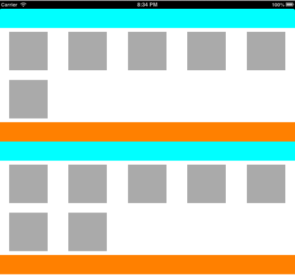
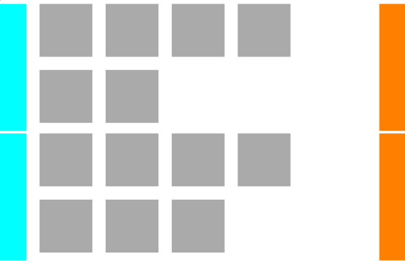

##CustomCollectionViewFlowLayout

CustomPositionFlowLayout is a subclass of UICollectionViewFlowLayout, that allows setting **any** position to any item, section header or section footer in your collection view.

## Usage

Using UICollectionView requires iOS 6. However, there's great [drop-in replacement](https://github.com/steipete/PSTCollectionView) for iOS 4.3 and higher.

* Drag and drop CustomCollectionViewFlowLayout.h and .m into project.
* Create subclass of it and override 3 methods:

    	-(CGSize)collectionViewContentSize;
    	
		-(CGRect)frameForItemAtIndexPath:(NSIndexPath *)indexPath;
		
		-(CGRect)frameForSupplementaryViewOfKind:(NSString *)kind
                            		 atIndexPath:(NSIndexPath *)indexPath;
            
And that's it!

## Demo

Sometimes picture is worth a thousand words =)

###Standard UICollectionViewFlowLayout

###CustomCollectionViewFlowLayout 
(code provided in Example folder. To switch between standard and custom layouts simply set flow layout class in IB)

